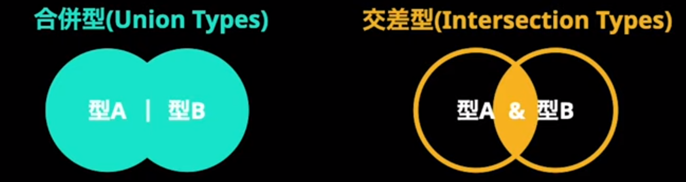
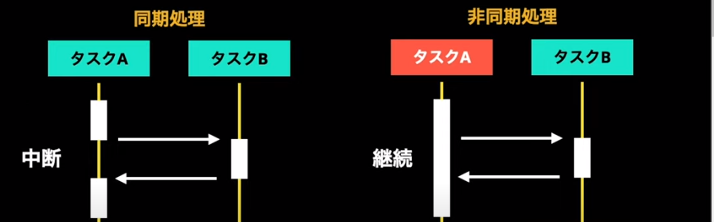

# TypeScript

## 基本の型定義
### 型推論と明示的な型定義
- TypeScriptは型を推論する
- 型アノテーションを使うことで明示的な型を定義する
``` ts
const name = 'Torahack'//①string型と推論される
const name: string = 'Torahack' //②明示的にstring型と定義することもできる
//ESLintのfixを使うとアノテーションが不要と判断されて②が①に修正される
```
### プリミティブ型
- string: すべての文字列の型
- number: 整数、浮動小数点数、整数、負数、Infinity(無限大)、NaN(非数) など数値の型
- boolean: trueとfalseの2つの値を扱う型
```ts
const name: string = 'Torahack'
const age: number = 28
const isSingle: boolean = true
//判定式の結果も代入できる
const isOver20: boolean = age > 20
```

### 存在しないことを表現する型
- null: 値が欠如していることを表す
- undefined: 初期化されておらず値が割り与えられていないことを表す
- できる限りundefinedを使う


### TypeScriptはanyを回避するゲーム
- any: どんな型でも許容する = 全く安全でない
- unknown: どんな型になるのか不明
- unknownは代入した値によって型が変化する


## 関数のパラメーターと戻り値に型をつける

### 関数で使われる特殊な型
- void: return文を持たない関数の戻り値
```ts
const logMessage = (message: string): void => {
    console.log('Function basic sample 1:', message)
}
```
- never: 決して戻ることのない関数の戻り値
```ts
const alwaysThrowError = (message: string): never => {
    throw new Error(message)
}
```

### 関数はどのように型定義するのか
1. パラメーター: 関数宣言時に渡される値(仮パラメーター)
1. 引数: 関数を呼び出すときに渡す値(実パラメーター)
1. 戻り値: 関数が返す値
```ts
const logMessage = (パラメーター): 戻り値 => {
    console.log('Function basic sample 1:', message)
}
logMessage(引数)
```

### オプションとデフォルト
オプションパラメーター
- パラメーターの最後に記述する
- オプショナルを表す``？``をつける
```ts
const inUserSignedIn = (userId: string, username?: string): boolean => {
    // ...
}
```

デフォルトパラメーター
- パラメーターの順序は関係なく記述できる。
- ``=``でデフォルトの値を指定する
```ts
const inUserSignedIn2 = (userId: string, username = 'NO NAME'): boolean => {
    // ...
}
```

### 可変長引数に型をつける
可変長引数とは？
- 関数呼び出しの際に引数をいくつ渡してもOK
- 全く型安全ではない

レストパラメーター
- パラメーターに``...``を用いることで型定義できる
- パラメーターの最後に1つだけ指定できる
```ts
const sumPrice = (...price: number[]): number => {
    // priceを使った処理
}
```

### 呼び出しシグネチャ
signature: メソッド名、パラメータの数と順序と型、戻り値の型
- どのような関数なのかを表現する型定義
- 省略記法はアロー関数と似た形
- 完全な記法はオブジェクトと似た形
```ts
type LogMessage = (message: string) => void
type FullLogMessage = {
    (message: string): void
}
const logMessage: logMessage = (message) => {
    console.log('function basic message:', message)
}
```

## 型エイリアス(type)でオブジェクトの型定義
### object型に意味はない
object型はobjectであることを伝えるだけ。  
_使わない。_
```ts
const a: object = {
    name: 'Torahack',
    age: 28
}
a.name // a というobjectにはnameというプロパティがないとエラーになる
```

オブジェクトリテラル記法を使う
- 構造を定義
- 各プロパティに型
```ts
let country: {
    language: string
    name: string
    // それぞれの型定義
} = {
    language: 'Japanese',
    name: 'Japan'
    // countryにこれらを代入
}
```

### 特別なプロパティを扱う
- オプショナル(？)のついたプロパティは なくてもOKになる
- readonlyのついたプロパティは上書きできない
```ts
let torahack: {
    age: number
    lastName: string
    readonly firstName: string
    gender?: string
} = {
    age: 28,
    lastName: 'Yamada',
    firstName: 'Tarou'
}

torahack.gender = 'male' // 後から追加できる
torahack.lastName = 'Kamado' // 上書きできる
torahack.firstName = 'Tanjiro' // 上書き不可
```

### オブジェクトの柔軟な型定義  
インデックスシグネチャ  
- オブジェクトが複数のプロパティを持つ可能性を示す
- `` [Key: T]: U `` のように定義する
- keyはstringかnumberのみ指定可能
```ts
const capitals: {
    [countryName: string]: string
} = {
    Japan: 'Tokyo',
    Korea: 'Soul'
}

capitals.China = 'Beijing'
capitals.Canada = 'Ottawa'

// {
//     Japan: string
//     Korea: string
//     ... ってやらなくて済む
// }
```

### 型エイリアスで型定義を再利用
型エイリアスとは
- typeを使って、型に名前をつけて宣言できる
- 同じ型を何度も定義する必要がない(再利用)
- 型に名前をつけることで変数の役割を明確化
```ts
type Country = {
    capital: string
    language: string
    name: string
}

const japan: Country = {
    capital: 'Tokyo',
    language: 'Japanese',
    name: 'Japan',
}
```

### 合併型(union)と交差型(intersection)
- 合併型(union): 型Aか型Bどちらかの型を持つ  
- 交差型(intersection): 型Aと型B両方の型を持つ  
交差型は「AとBに共通する型」ではない


```ts
type union = A | B
type intersection = A & B
```

## 配列・タプルの型定義
### 配列に秩序をもたらす型定義
配列の要素として持つ値の型を定義できる  
```ts
const colors: string[] = ['red', 'blue']
colors.push('yellow') // OK
colors.push(123) // NG
```

型定義方法: ``T[]`` と ``Array<T>`` は同義
```ts
const odd: number[] = [1, 3, 5]
const even: Array<number> = [2, 4, 6]
```

合併型も使える
```ts
const ids: (string | number)[] = ['ABC', 123]
ids.push("DEF") // OK
ids.push(456) // OK
```

### 配列の型推論
アノテーションしなくても型推論される
```ts
const generateSomeArray = () => {
    const _someArray = []   // any[]
    _someArray.push(123)    // number[]として推論される
    _someArray.push("ABC")  // (string | number)[] として推論される
    return _someArray
}

const someArray = generateSomeArray()
someArray.push(true) // NG
```

### 厳格な配列 タプル
タプルは配列の各要素の数と型を定義できる
```ts
let response: [number, string] = [200, "OK"]
response = [400, "Bad Request", "Email parameter is missing"] // error 要素は2つまで
respones = ["400", "Bad Request"] // error 0番目が文字列になっている
```

可変長(レストパラメーター)も使える
```ts
const foo: [string, ...string[]] = ["bar", "baz", "hoge"]
```

### イミュータブルな配列
JavaScriptの配列はconstで宣言してもミュータブル(書き換え可)
```ts
const mutableNumbers: number[] = [1, 2, 3]
mutableNumbers[2] = 4
```

readonlyでイミュータブル(書き換え不可)な配列/タプルを作れる
```ts
const commands: readonly string[] = ["git add", "git commit", "git push"]
commands.push("git fetch") // error 追加不可
commands[2] = "git pull" /z/ error 代入不可

const numbers: ReadonlyArray<number> = [1, 2, 3]
const names: Readonly<string[]> = ["Tarou", "Kazu"]
```

## ジェネリック型とポリモーフィズム
### 型を抽象化するジェネリック型
型の種類は異なるが同じデータの構造を共通化する
```ts
const stringReduce = (array: string[], initialValue: string): string => {}
const numberReduce = (array: number[], initialValue: number): number
```

ジェネリック型パラメーター (引数のようなもの)
- 型をパラメーター化 (後から実パラメーターを渡す(バインドする))
- T, U, V, W などがよく使われる
```ts
type Reduce<T> = {
    (array: T[], initialValue: T): T
}
const reduce: Reduce<string> = (array, initialValue) => {}
```

### ジェネリックの宣言方法
「呼び出しシグネチャの記法」と 「ジェネリック型の割り当て範囲」によって異なる
```ts
// 完全な呼び出しシグネチャ (シグネチャ全体にジェネリック型を割り当てる)
type GenericRedce<T> = {
    (array: T[], initialValue: T): T
}

// 完全な呼び出しシグネチャ (個々のシグネチャにジェネリック型を割り当てる)
type GenericReduce2 = {
    <T>(array: T[], initialvalue: T): T
    <U>(array: U[], initialvalue: U): U
}

// 呼び出しシグネチャの省略記法
type GenericReduce3<T> = (array: T[], initialValue: T) => T
type GenericReduce4 = <T>(array: T[], initialValue: T) => T
```

### 呼び出し側の共通化
ポリモーフィズム  
多態性・多相性 = 色々な形に変化できること  
ジェネリック型を用いると
- 型を抽象化して共通化できる
- 呼び出すときに具体的な方を渡す  


## オブジェクト指向
### オブジェクト指向は再利用のために使う
オブジェクト指向: 再利用のための「仕組み」  
クラスの3つの役割
1. まとめる: ある機能についてのデータと振る舞いをまとめる
1. 隠す: 外部から参照・改変できないようにする
1. たくさん: 同じ機能を持つクローンを量産できる

### 用語の整理
- プロパティ  
    クラスが持つデータ。フィールド、メンバ変数とも呼ばれる
- メソッド  
    クラスで宣言する関数のこと。
- コンストラクタ  
    クラスからインスタンスを作るときに行う初期化
- インスタンス  
    クラスから作られたオブジェクト  
    クラスの機能をもつクローンみたいな

### 将棋をモデル化してみよう
将棋をモデル化する
```ts
class Game {} // 将棋のゲーム
class Piece {} // 将棋の駒
class Position {} // 駒の位置

class Osho extends Piece {}
class Hisha extends Piece {}
class Kaku extends Piece {}
class Kin extends Piece {}
class Gin extends Piece {}
class Keima extends Piece {}
class Kyosha extends Piece {}
class Fu extends Piece {}
```

### 駒の位置をクラスにする
(筋: 列、段: 行)
```ts
type Suji = 1  |  2  |  3  |  4  |  5  |  6  |  7  |  8  |  9
type Dan = '1' | '2' | '3' | '4' | '5' | '6' | '7' | '8' | '9'

class Position {
    constructor (
        private suji: Suji,
        private dan: Dan
    ) {}
}
```
``private``: そのクラスのみでアクセス可能  
``protected``: そのクラスとサブクラスでのみアクセス可能  
``public``: どこからでもアクセス可能(デフォルト)  

### 抽象クラスはインスタンス化できない
```ts
abstract class Piece {
    protected position: Position
    constructor(
        private readonly player: Player,
        suji: Suji,
        dan: Dan
    ) {
        this.position = new Position(suji, dan)
    }
}
new Piece('first', 5, '1') // error 抽象クラスだからインスタンス化不可
```
抽象クラス(abstract修飾子のついたクラス)  
抽象クラスはインスタンス化できない  
継承でサブクラスを作るためのクラス  

### 駒のサブクラスを宣言する
```ts
abstract class Piece {
    // ... 省略
    // パラメーターに渡された位置へ駒を移動するメソッド
    // publicなので、サブクラスでオーバーライド(上書き)できる
    moveTo(psotion: Position) {
        this.position: = position
    }
    // 移動できるかどうか判定するメソッド
    // abstractをつけて宣言しておき、サブクラスで具体的に実装する
    abstract canMoveTo(psotion: Position, player: Player): boolean
}

class Osho extends Piece {
    // 具体的な実装
    canMoveTo(position: Position, player: Player): boolean {
        let distance = this.position.distanceFrom(position)
        return distance.suji < 2 && distance.dan < 2
    }
}
```

### Gameクラスで駒を生成&初期化
```ts
class Game {
    private pieces = Game.makePieces()
    private static makePieces() {
        return [
            new Osho('first', 5, '1'),
            new Osho('second', 5, '9')
        ]
    }
}
```

## InterfaceとType Alias
### Interfaceの基本用法と宣言のマージ  
- interface宣言子で定義
- Type Alias と違って ``=`` は不要
    ```ts
    interface Bread {
        calories: number
    }
    ```
- 同名のinterfaceを宣言すると型が追加(マージ)される
- 宣言のマージ: 同じ名前を共有する複数の宣言を自動的に結合
    ```ts
    interface Bread {
        type: string
    }
    const francePan: Bread = {
        calories: 350,
        type: 'hard'
    }
    ```

### Interfaceの拡張
- extends を使うことでサブインターフェースを作れる
- Type Alias を extends することもできる
```ts
interface Book {
    page: number
    title: string
}

interface Magazine extends Book {
    cycle: 'daily' | 'weekly' | 'monthly' | 'yearly'
}

const jump: Magazine = {
    cycle: 'weekly',
    page: 300,
    title: '週間少年ジャンプ'
}
```

### interfaceでclassに型を定義できる
- implementsを使ってclassに型を定義できる (implements: 実装する)
```ts
interface Book {
    page: number
    title: string
}

class Comic implements Book {
    page: number
    title: string

    constructor(page: number, title: string) {
        this.page = page
        this.title = title
    }
}

const popularComic = new Comic(200, '進撃の巨人')
```

### Type Alias と Interfae の違いまとめ
| | Type Alias | Interface |
|-|-|-|
|用途|複数の場所で再利用する型に名前をつけるため|オブジェクト・クラス・関数の構造を定義するため|
|拡張性|同名のtypeを宣言するとエラー|同名のinterfaceを宣言するとマージされる|
|継承|継承はできない 交差型で新しい型エイリアスを作る|extendsによる継承ができる|
|使用できる型|オブジェクトや関数以外のプリミティブ・配列・タプルも宣言可能|オブジェクトと関数の型のみ宣言可能|
|考慮事項|拡張しにくい不便さがある|拡張できることによりバグを生む可能性がある|
|いつ使う|アプリ開発|ライブラリ開発|  


## 非同期処理 APIから安全にデータ取得
### 非同期処理とは
- 通信が発生する処理で起きる
    - Web API を叩く
    - データベースへクエリを投げる
- 実行完了を待たずに次の処理へ進む
- JavaScriptはシングルスレッドの言語  
    非同期APIにより効率よく処理を行うことが可能

### 非同期処理は一長一短
- 複数の処理を並行して効率よく実行できる
    重い処理や時間のかかる通信中にユーザーに別の操作を許可するなど
- 制御が難しい
    処理が実行中なのか実行完了したのかトレースしにくい
- どう対処すべき？
    - Promiseやasync/awaitで非同期処理を同期的に制御する
    - 型をつけてわかりやすくする



### Promise型で実行完了後の値を定義する
非同期処理の実行結果は``Promise<string>``のように定義できる
```ts
type FetchProfile = () Promise<Profile | null> 
const fetchProfile: FetchProfile = () => {
    // 非同期処理を行い、最終的にProfileかnullを返す
}
```
Promiseの状態  
- ``Promise<pending>``: 初期状態/実行中  
- ``Promise<fulfilled>``: 処理が成功して完了した状態  
- ``Promise<rejected>``: 処理が失敗して完了した状態  
```ts
const func: Func = async () => {
    const func2: Func2: = async () => {
        const res = await fetch(url)
            .then((res) => res)
            .catch((err) => {
                console.error(err)
                return null
            })
        if(!res) return null
        
        const json = await res.json()
            .then()
            // ...
        
    }
}
```